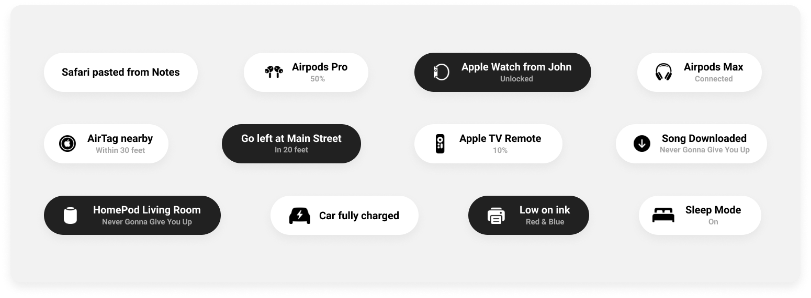

# Toast-Swift

[](https://www.codacy.com/gh/BastiaanJansen/Toast-Swift/dashboard?utm_source=github.com&amp;utm_medium=referral&amp;utm_content=BastiaanJansen/Toast-Swift&amp;utm_campaign=Badge_Grade)


A Swift Toast view - iOS 14 style - built with UIKit. 🍞



## Installation

### Swift Package Manager
You can use The Swift Package Manager to install Toast-Swift by adding the description to your Package.swift file:
```swift
dependencies: [
    .package(url: "https://github.com/BastiaanJansen/toast-swift", from: "1.5.0")
]
```

### CocoaPods
```swift
pod "ToastViewSwift"
```

## Usage
To create a simple text based toast:
```swift
let toast = Toast.text("Safari pasted from Notes")
toast.show()
```

Or add a subtitle:
```swift
let toast = Toast.text("Safari pasted from Notes", subtitle: "A few seconds ago")
toast.show()
```

And if you want to use your own font(NSAttributedString is supported):
```swift
let attributes = [
    NSAttributedStringKey.font: UIFont(name: "HelveticaNeue-Bold", size: 17)!, 
    NSAttributedStringKey.foregroundColor: UIColor.black
]
let attributedString  = NSMutableAttributedString(string: "Safari pasted from Notes" , attributes: attributes)
let toast = Toast.text(attributedString)
toast.show()
```

If you want to add an icon, use the `default` method to construct a toast:
```swift
let toast = Toast.default(
    image: UIImage(systemName: "airpodspro")!,
    title: "Airpods Pro",
    subtitle: "Connected"
)
toast.show()
```

Want to use a different layout, but still use the Apple style? Create your own view and inject it into the `AppleToastView` class when creating a custom toast:
```swift
let customView: UIView = // Custom view

let appleToastView = AppleToastView(child: customView)

let toast = Toast.custom(view: appleToastView)
toast.show()
```

The `show` method accepts several optional parameters. `haptic` of type `UINotificationFeedbackGenerator.FeedbackType` to use haptics and `after` of type `TimeInterval` to show the toast after a certain amount of time:
```swift
toast.show(haptic: .success, after: 1)
```

### Configuration options    
The `text`, `default` and `custom` methods support custom configuration options. The following options are available:

| Name            | Description                                                                                         | Type           | Default |
|-----------------|-----------------------------------------------------------------------------------------------------|----------------|---------|
| `direction`      | Where the toast will be shown.        | `.bottom` or `.up`        | `.up`  |
| `autoHide`      | When set to true, the toast will automatically close itself after display time has elapsed.         | `Bool`         | `true`  |
| `enablePanToClose`      | When set to true, the toast will be able to close by swiping up.         | `Bool`         | `true`  |
| `displayTime`   | The duration the toast will be displayed before it will close when autoHide set to true in seconds. | `TimeInterval` | `4`     |
| `animationTime` | Duration of the show and close animation in seconds.                                                | `TimeInterval` | `0.2`   |
| `enteringAnimation` | The type of animation that will be used when toast is showing                                   | `.slide`, `.fade`, `.scaleAndSlide`, `.scale` and `.custom` | `.default`|
| `exitingAnimation` | The type of animation that will be used when toast is exiting                                    | `.slide`, `.fade`, `.scaleAndSlide`, `.scale` and `.custom` | `.default`|
| `attachTo`      | The view which the toast view will be attached to.                                                  | `UIView`       | `nil`   |


```swift
let config = ToastConfiguration(
    direction: .top,
    autoHide: true,
    enablePanToClose: true,
    displayTime: 5,
    animationTime: 0.2
)

let toast = toast.text("Safari pasted from Notes", config: config)
```

### Custom entering/exiting animations
```swift
self.toast = Toast.text(
            "Safari pasted from Noted",
            config: .init(
                direction: .bottom,
                enteringAnimation: .fade(alphaValue: 0.5),
                exitingAnimation: .slide(x: 0, y: 100))
            ).show()
```
The above configuration will show a toast that will appear on screen with an animation of fade-in. And then when exiting will go down and disapear.

```swift
self.toast = Toast.text(
            "Safari pasted from Noted",
            config: .init(
                direction: .bottom,
                enteringAnimation: .scale(scaleX: 0.6, scaleY: 0.6),
                exitingAnimation: .default
            ).show()
```
The above configuration will show a toast that will appear on screen with scaling up animation from 0.6 to 1.0. And then when exiting will use our default animation (which is scaleAndSlide)

For more on animation see the `Toast.AnimationType` enum.

### Custom toast view
Don't like the default Apple'ish style? No problem, it is also possible to use a custom toast view with the `custom` method. Firstly, create a class that confirms to the `ToastView` protocol:
```swift
class CustomToastView : UIView, ToastView {
    private let text: String

    public init(text: String) {
        self.text = text
    }

    func createView(for toast: Toast) {
        // View is added to superview, create and style layout and add constraints
    }
}
```
Use your custom view with the `custom` construct method on `Toast`:
```swift
let customToastView: ToastView = CustomToastView(text: "Safari pasted from Notes")

let toast = Toast.custom(view: customToastView)
toast.show()
```

### Queues
To show toasts after each other, use the `ToastQueue` class:

```swift
let toast1 = Toast.text("Notification 1")
let toast2 = Toast.text("Notification 2")
let toast3 = Toast.text("Notification 3")

let queue = ToastQueue(toasts: [toast1, toast2, toast3])

queue.show()
```

### Delegates
Below delegate functions are optional to implement when implementing `ToastDelegate`.

```swift
extension MyViewController: ToastDelegate {
    func willShowToast(_ toast: Toast) {
        print("Toast will be shown after this")
    }

    func didShowToast(_ toast: Toast) {
        print("Toast was shown")
    }

    func willCloseToast(_ toast: Toast) {
        print("Toast will be closed after this")
    }

    func didCloseToast(_ toast: Toast) {
        print("Toast was closed (either automatically, dismissed by user or programmatically)")
    }
}
```
## Licence
Toast-Swift is available under the MIT licence. See the LICENCE for more info.

[](https://github.com/BastiaanJansen/Toast-Swift/stargazers)
