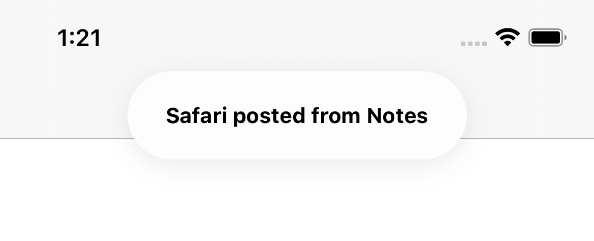
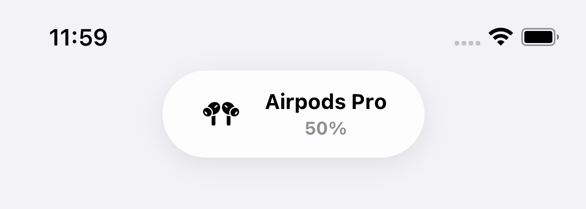
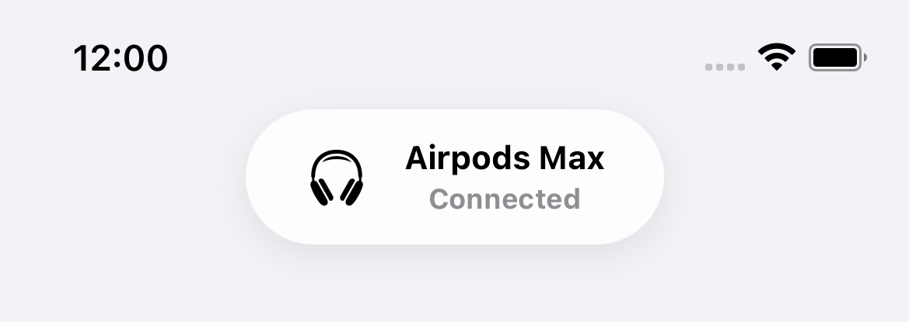
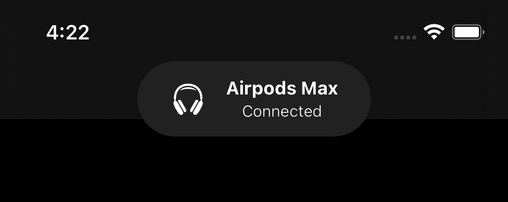

# Toast-Swift

A Swift Toast view - iOS 14 and newer style - built with UIKit. 🍞

<div align="center">
  <div>
    
    
    
  <div>
  
  <div>
    
    
    
  </div>
</div>

## Installation

## Usage
To create a simple text based toast:
```swift
let toast = Toast.text("Safari pasted from Notes")
toast.show()
```

Or add a subtitle:
```swift
let toast = Toast.text("Safari pasted from Notes", subtitle: "A few seconds ago")
toast.show()
```

If you want to add an icon, use the `default` method to construct a toast:
```swift
let toast = Toast.default(
  image: UIImage(systemname: "airpodspro")!,
  title: "Airpods Pro",
  subtitle: "Connected"
)
toast.show()
```

It is also possible to use a custom view with the `custom` method:
```swift
let view: UIView = // View code

let toast = Toast.custom(view: view)
toast.show()
```

The `show` method accepts several optional parameters. `haptic` of type `UINotificationFeedbackGenerator.FeedbackType` to use haptics and `after` of type `TimeInterval` to show the toast after a certain amount of time:
```swift
toast.show(haptic: .success, after: 1)
```

The `text`, `default` and `custom` methods support custom configuration options. The following options are available:

|      Name     |        Type       |          Default         |
|:-------------:|:-----------------:|:------------------------:|
|    autoHide   |       `Bool`      |          `true`          |
|  displayTime  |   `TimeInterval`  |            `4`           |
| swipeUpToHide |       `Bool`      |          `true`          |
| animationTime |   `TimeInterval`  |           `0.2`          |
|      view     |      `UIView`     |           `nil`          |
|     onTap     |  `(Toast) -> ()`  |           `nil`          |
|   appearance  | `ToastAppearance` | `DefaultToastAppearance` |


```swift
let config = ToastConfiguration(
  autoHide: true,
  displayTime: 5,
  swipeUpToHide: true,
  animationTime: 0.2,
  onTap: { Toast in
      toast.close()
  }
)

let toast = toast.text("Safari pasted from Notes", config: config)
```
